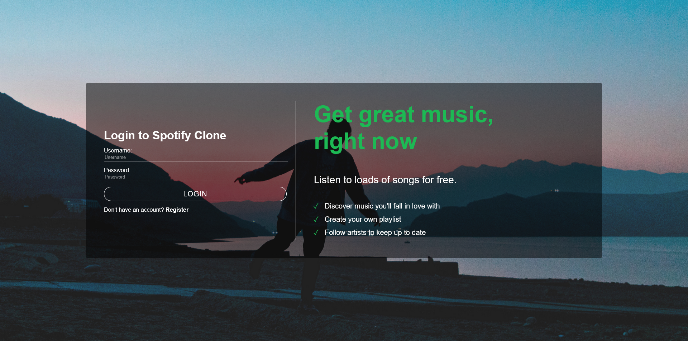
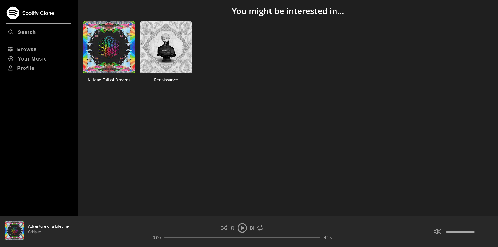
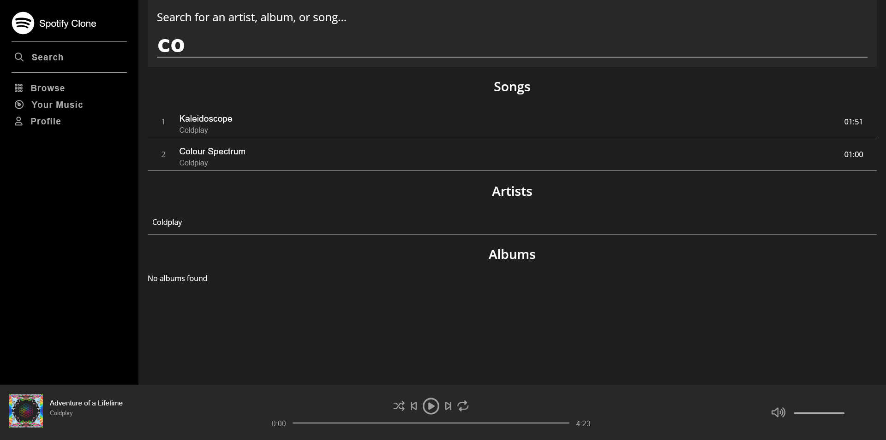
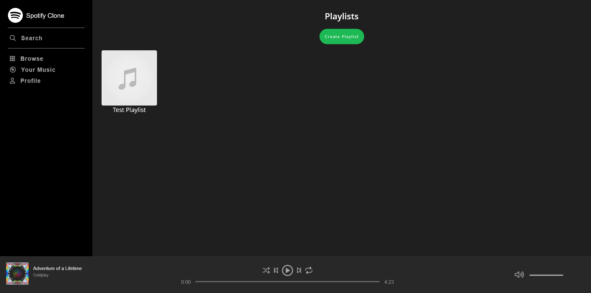
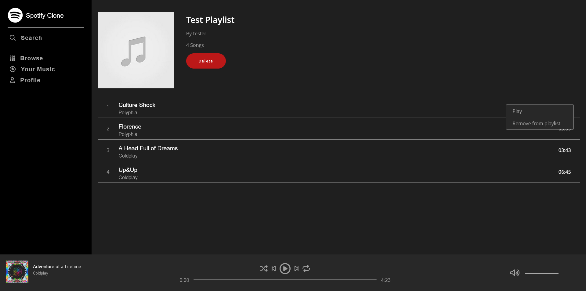
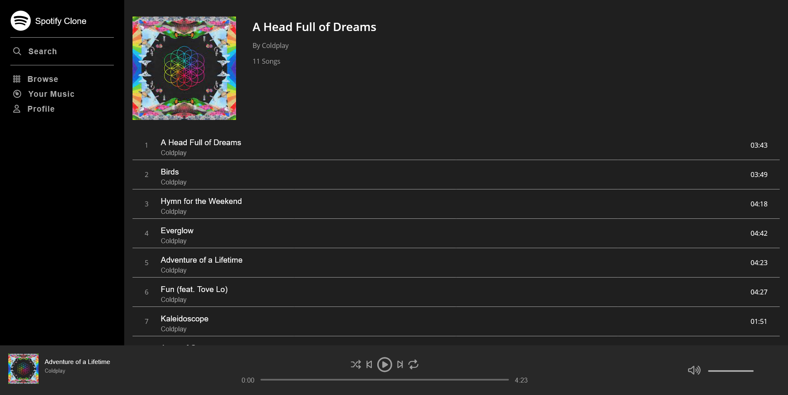
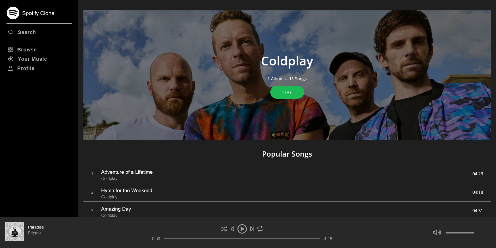
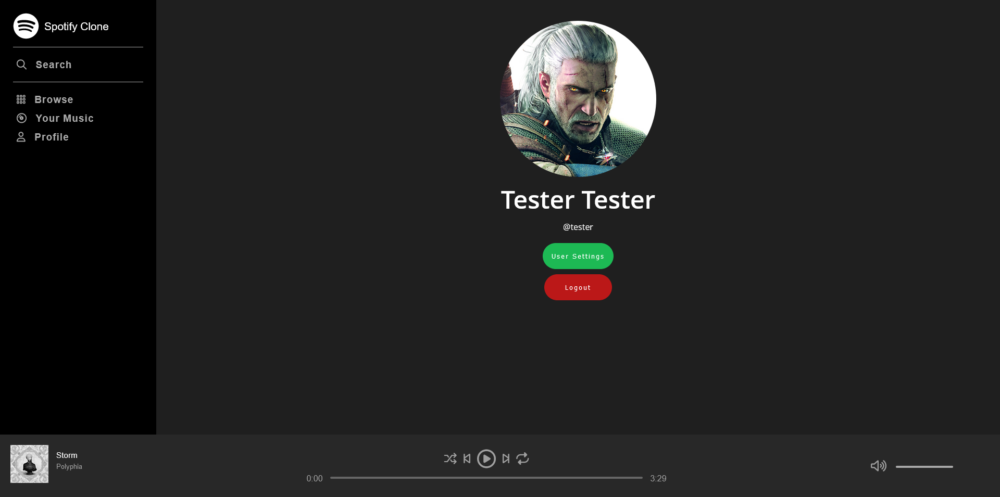
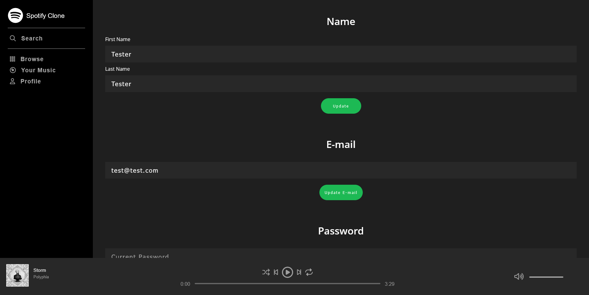
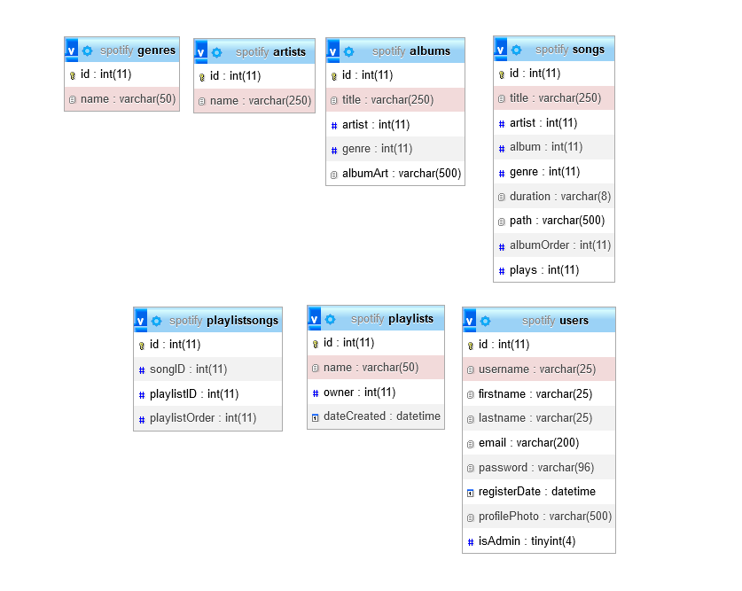

# Spotify Clone

**Note**: This project was conducted by following [this course](https://www.udemy.com/course/spotify-clone/).

**Spotify Clone** is a personal development project to learn how to build a web site with PHP. Most of the site is built by following the course. But i tried to write my own code most of the time.

I know that the proper way is to handle entry point on one file and use require to load the other files. But i doing this way is easier to understand for me.

Also in a proper site there should be a proper routing system.

Screenshot of the site:

Login and Register page.

Browse page.

Search page.

Your music page.

Playlist page.

Album page.

Artist page.

Profile page.

Settings page.

Database schema.